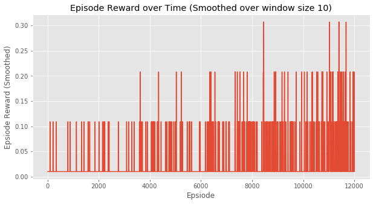
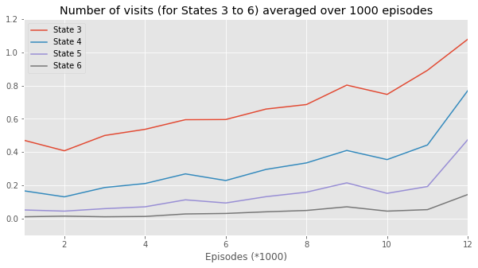

# pytorch-hDQN

`hierarchical-DQN` in pytorch. [[paper]](https://arxiv.org/abs/1604.06057)

## Results

Only `Q-learning` and `h-DQN` for `StochasticMDPEnv` are implemented.

### Q-Learning for Experiment 1 (Discrete stochastic decision process)

### h-DQN for Experiment 1 (Discrete stochastic decision process)

## Reference

<https://github.com/EthanMacdonald/h-DQN>: Another implementation of `hierarchical-DQN` paper, which I copied the `StochasticMDPEnv` from.
