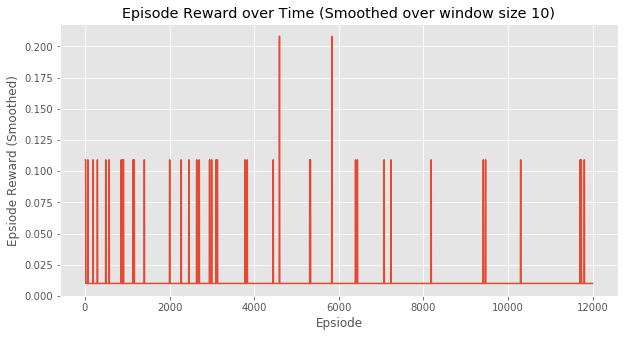

# pytorch-hDQN

`hierarchical-DQN` in pytorch

## Results

I only implemented the q-learning for `StochasticMDPEnv`.

I plan to implement `hierarchical-DQN` in the near future.

### Q-Learning for Experiment 1 (Discrete stochastic decision process)

## Reference

<https://github.com/EthanMacdonald/h-DQN> Another implementation of `hierarchical-DQN` paper, which I copied the `StochasticMDPEnv` from.
